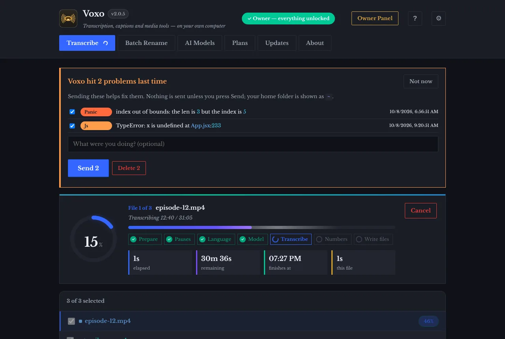
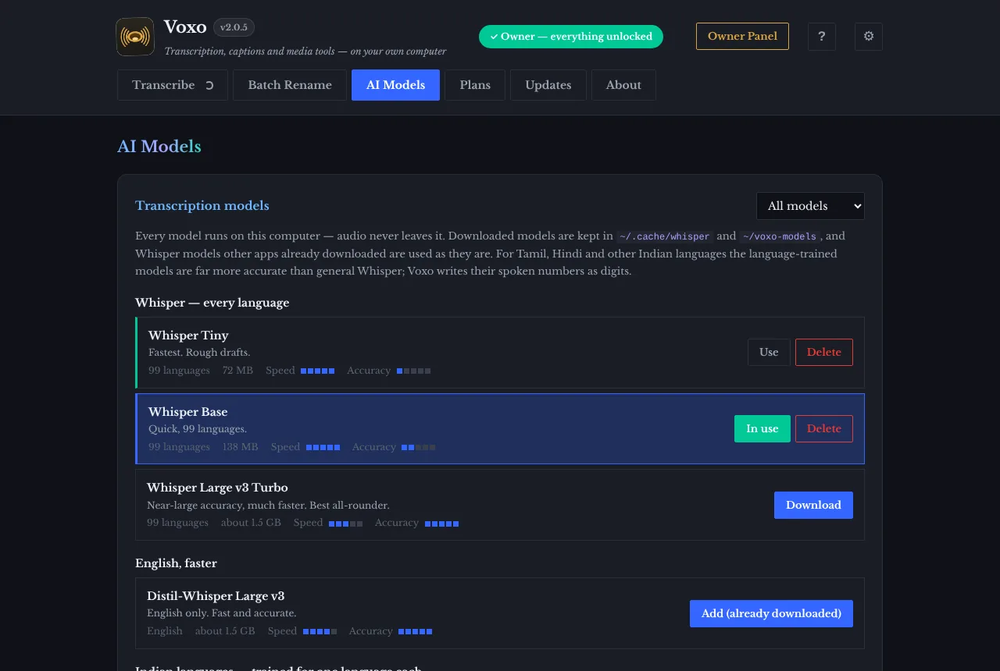
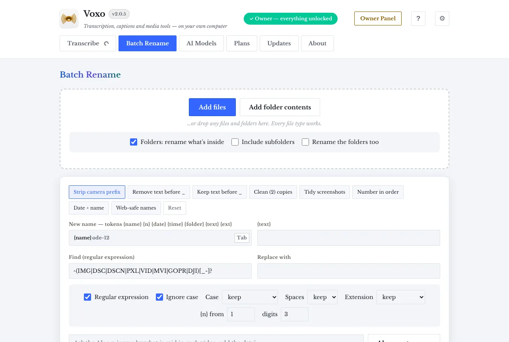
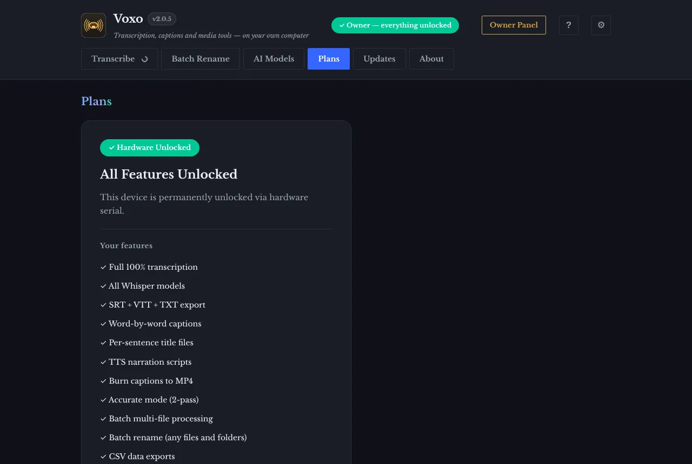
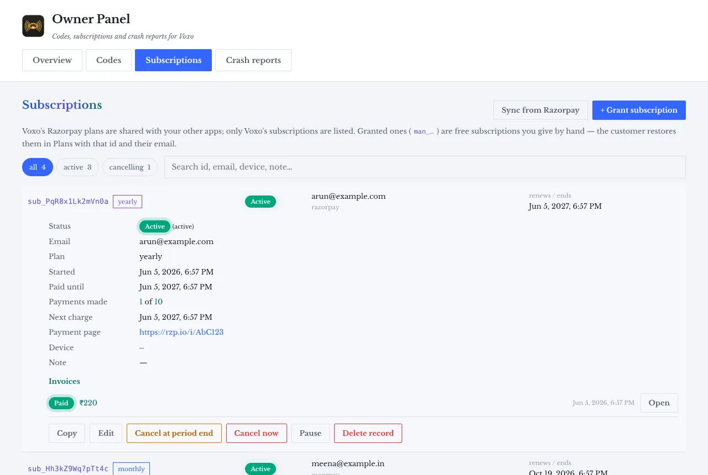
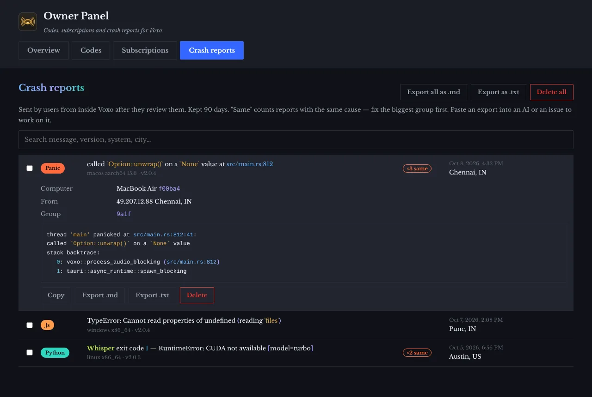
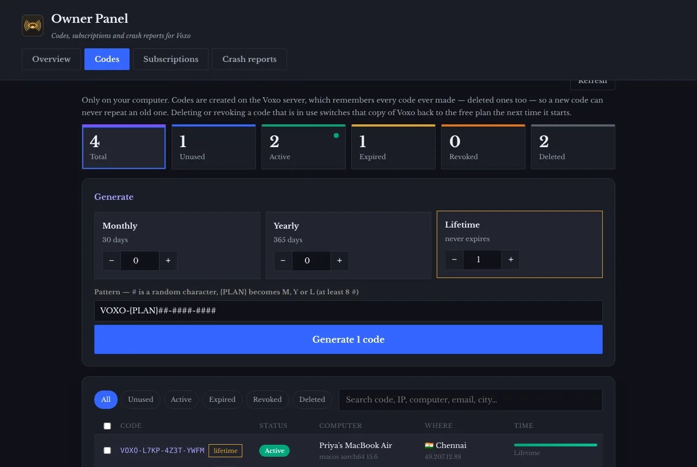

<p align="center">
  <picture>
    <source media="(prefers-color-scheme: dark)" srcset="icon-dark.png">
    
  </picture>
</p>

<h1 align="center">Voxo 2.0.5</h1>

<p align="center">Transcription, captions and batch media tools that run on your own computer.<br>
macOS, Windows and Linux. Audio never leaves your machine.</p>

<p align="center">
  &nbsp;
  
</p>

<p align="center">
  <a href="https://github.com/JKS-sys/Voxo-06-Sep-2026-Releases/releases/tag/v2.0.5"><b>Download Voxo 2.0.5</b></a> ·
  <a href="https://ipconfig.co.network/voxo"><b>Website — ipconfig.co.network/voxo</b></a> ·
  <a href="#install-in-one-line">Install in one line</a>
</p>

<p align="center"><a href="screenshots/splash-dark.webp"></a></p>

## Install in one line

**macOS or Linux** — downloads the right file for your computer, checks it and installs it:

```bash
curl -fsSL https://raw.githubusercontent.com/JKS-sys/Voxo-06-Sep-2026-Releases/main/install.sh | sh
```

**Windows 10/11** (PowerShell):

```powershell
irm https://raw.githubusercontent.com/JKS-sys/Voxo-06-Sep-2026-Releases/main/install.ps1 | iex
```

**Homebrew** (macOS) — no tap, no extra repository; the cask file comes straight from this release page:

```bash
curl -fsSLo /tmp/voxo.rb https://raw.githubusercontent.com/JKS-sys/Voxo-06-Sep-2026-Releases/main/voxo.rb && HOMEBREW_DEVELOPER=1 brew install --cask /tmp/voxo.rb
```

Homebrew 5 only installs from a file when `HOMEBREW_DEVELOPER=1` is set, and it is phasing out apps that are not
notarized by Apple (Voxo is not yet). If that command stops working, use the curl line above — it does the same thing.

## Download Voxo 2.0.5

| System | File |
|---|---|
| macOS — Apple silicon (M1–M4) | [Voxo_2.0.5_aarch64.dmg](https://github.com/JKS-sys/Voxo-06-Sep-2026-Releases/releases/download/v2.0.5/Voxo_2.0.5_aarch64.dmg) |
| macOS — Intel | [Voxo_2.0.5_x64.dmg](https://github.com/JKS-sys/Voxo-06-Sep-2026-Releases/releases/download/v2.0.5/Voxo_2.0.5_x64.dmg) |
| Windows 10/11 — 64-bit | [Voxo_2.0.5_x64-setup.exe](https://github.com/JKS-sys/Voxo-06-Sep-2026-Releases/releases/download/v2.0.5/Voxo_2.0.5_x64-setup.exe) |
| Linux — any distribution | [Voxo_2.0.5_amd64.AppImage](https://github.com/JKS-sys/Voxo-06-Sep-2026-Releases/releases/download/v2.0.5/Voxo_2.0.5_amd64.AppImage) |
| Linux — Debian / Ubuntu | [Voxo_2.0.5_amd64.deb](https://github.com/JKS-sys/Voxo-06-Sep-2026-Releases/releases/download/v2.0.5/Voxo_2.0.5_amd64.deb) |

Release page: https://github.com/JKS-sys/Voxo-06-Sep-2026-Releases/releases/tag/v2.0.5 · Also on the website: https://ipconfig.co.network/voxo · Once installed, Voxo updates itself.

**macOS:** Voxo is not signed with an Apple Developer ID. After dragging it to Applications, run once in Terminal
(the one-line installers do this for you):

```bash
xattr -cr /Applications/Voxo.app
```

**Windows:** if SmartScreen warns about an unknown publisher, choose More info → Run anyway.
**Linux:** `chmod +x Voxo_*.AppImage && ./Voxo_*.AppImage`, or `sudo apt install ./Voxo_*.deb`.

## Screenshots

### Transcribe



Drop audio or video and watch every step — pauses, language, model, transcription, numbers — with the percentage, time elapsed, time left and the clock time it will finish. Problems from last time are offered for sending, never sent on their own.

### AI Models



Download, use and delete local Whisper models, fast English models and models trained for Tamil, Hindi, Telugu, Kannada, Gujarati, Malayalam and Bengali. The free built-in Voxo AI works for every user.

### Batch Rename



Rename any files, folders or whole folder trees with presets, templates, find and replace, numbering and AI-suggested names — with a live preview and one-click undo.

### Plans



₹20 a month or ₹220 a year through Razorpay, or a monthly, yearly or lifetime activation code. Basic models and the free AI stay free for everyone.

### About


The app, its release notes and the creator in one place.

### Owner Panel — subscriptions



For the developer only, in its own window: every subscription with payments and invoices; grant, edit, pause, resume, cancel or delete.

### Owner Panel — crash reports



Crash reports users chose to send, grouped by cause, readable with colour, deletable and exportable as .md or .txt.

### Owner Panel — activation codes



Generate monthly, yearly and lifetime codes that can never repeat; see which computer, IP and city used each one, and when it expires.

## Features

- **Local AI transcription** — Whisper Tiny to Large v3 and Large v3 Turbo, Distil-Whisper for fast English, and language-trained models for Tamil, Hindi, Telugu, Kannada, Gujarati, Malayalam and Bengali. Download, use and delete them in the AI Models tab; models already on your computer are reused.
- **Numbers as digits** — spoken numbers become 2024, 3,500, 49 in English, Tamil and Hindi, with exact subtitle timing.
- **Progress you can read** — each step with percentage, time elapsed, time remaining and finish time, for one file or a whole batch.
- **Subtitles and scripts** — SRT, VTT, timestamped and plain TXT, word-by-word captions, per-sentence title files, TTS narration scripts, captions burned into MP4.
- **Batch rename for every file type** — files, folders or whole folder trees; templates, find and replace, case, numbering, dates; live preview with clash checks and one-click undo.
- **AI assistant** — autocomplete, rename ideas and title/description/chapter suggestions, using free local models (Ollama, LM Studio), GitHub Models (the models behind GitHub Copilot) or any OpenAI-compatible URL.
- **Auto-detects the language**, or pick one of 20.
- **Sound effects and motion** — with on/off, volume, and reduced-motion respected.
- **Light and dark** appearance, automatic or chosen.
- **Plans** — ₹20/month or ₹220/year with Razorpay, or monthly, yearly and lifetime activation codes.
- **Signed updates** from GitHub and Cloudflare R2, checked before they install.
- **Free built-in AI for every user** — Voxo AI needs no setup and no subscription; basic Whisper models stay free too.
- **Crash reports you control** — problems are recorded on your computer and only sent if you press Send.
- **Startup animation, six sound packs** (Soft, Crisp, Retro, Glass, Wood, Space), keyboard shortcuts (press **?**), recent-transcription history and daily milestones.
- **Colour that means one thing everywhere** — numbers, brackets, timestamps, files, errors and successes each have their own colour (no pink), in every tab and window.
- **One-line install** on macOS, Linux and Windows, or Homebrew without a tap.
- **Owner Panel** (developer only, its own window): activation codes, subscriptions with full edit/cancel/pause, and crash reports with export to .md or .txt.

## What's new in 2.0.5

### Owner Panel in its own window
- The owner's computer gets an Owner Panel button that opens a separate window with an
  Overview, activation Codes, Subscriptions and Crash reports.
- Subscriptions: every Voxo subscription with status, payments made, next charge, payment
  page and invoices; grant a free subscription by hand, edit email, plan, end date and note,
  cancel now or at the end of the period, pause, resume, or delete the record. Sync pulls
  Voxo's subscriptions from Razorpay (plans shared with other apps are filtered out).
- Crash reports: grouped by cause ("×3 same"), searchable, readable in colour, deletable one,
  many or all at once, and exportable as .md or .txt.

### Crash reports you control
- Rust panics, JavaScript errors, unhandled promise errors, panel errors and macOS crash logs
  are recorded on your computer. Next launch, Voxo shows them and sends only what you choose,
  with an optional note; your home folder is replaced by ~. A failing panel now shows a
  "Try again" card instead of blanking the whole window.

### Free AI for everyone
- Voxo AI is built in and free for every user, paid or not — autocomplete, rename ideas and
  title/description/chapter suggestions work with no setup. Basic Whisper models stay free.

### Startup animation, more sound and colour
- A startup animation with its own sound (any key skips it; it can be turned off or replayed
  in Settings ⚙).
- Six sound packs — Soft, Crisp, Retro, Glass, Wood, Space — plus new sounds for sending,
  exporting, copying, cleaning and milestones.
- Colour means one thing everywhere, with no pink: numbers cyan, brackets violet, timestamps
  teal, quoted text amber, files blue, success green, errors red, warnings orange, and one
  colour per file type — in logs, file lists, crash reports and the Owner Panel.

### More features
- Recent transcriptions list with Open folder and Copy text.
- Daily milestones (1st, 3rd, 5th, 10th, 25th file) with a fanfare.
- Keyboard shortcuts: ⌘/Ctrl O add files, ⌘/Ctrl Enter start, Esc cancel, ⌘/Ctrl 1–6 tabs,
  ⌥⌘S sounds, ⌘/Ctrl , settings, ? for the list.

### Smaller and easier to install
- About 1.6 MB smaller: unused images and a file plugin removed from the app.
- Install in one line: `curl -fsSL …/install.sh | sh` (macOS, Linux), `irm …/install.ps1 | iex`
  (Windows), or Homebrew without a tap. The GitHub page now has screenshots with descriptions
  and links to the release and to ipconfig.co.network/voxo.
- After a release finishes, older installers are removed from GitHub (release pages and notes
  stay).

### Privacy
- The server now stores a hash of your computer's id instead of its serial number.

macOS: after installing, run `xattr -cr /Applications/Voxo.app` once.

## Support

Questions: JKS.sys@icloud.com · Sponsor Voxo: https://razorpay.me/@NSBJKS · Website: https://ipconfig.co.network/voxo

Made by Jagadeesh Kumar S, creator — [youtube.com/@JKS-sys](https://youtube.com/@JKS-sys).
